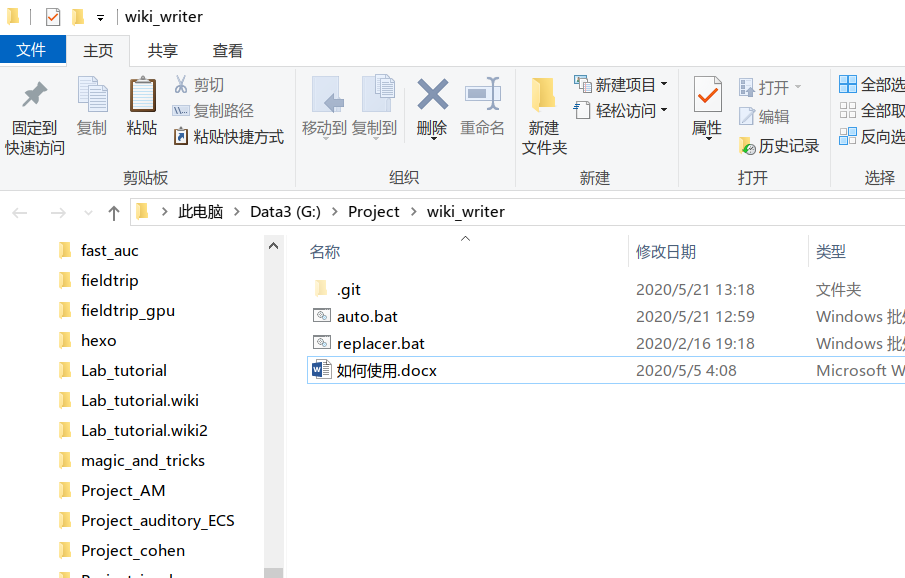
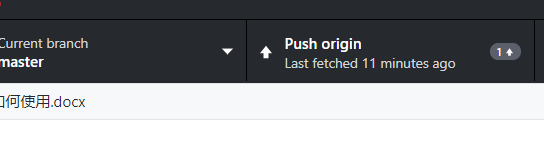

第一步，安装pandoc

打开网站：<https://pandoc.org/installing.html>

按照说明安装，若安装成功则在命令提示行中输入会有所提示

接下来安装github desktop

<https://desktop.github.com/>

按照提示安装。

接下来，进入到你要写的code的界面，比如我这个wiki writer的code，然后点击code中的Clone or
download,之后点击open in desktop地址

打开github desktop后，先clone到本地，再点击repository – show in
Explorer,然后打开相应文件夹，然后将写好的wiki内容的word文档保存在同一路径上，注意word文件的名字，这个名字也会是code中的标题。

将word文档拖到auto.bat上

这个时候就会生成一个md文件，和一个images文件夹

这个时候再打开github desktop，在summary处写入编辑内容，点击commit to master

再点击push origin

然后你就能在那个Code页面看到你的文件（不在wiki界面中）了

